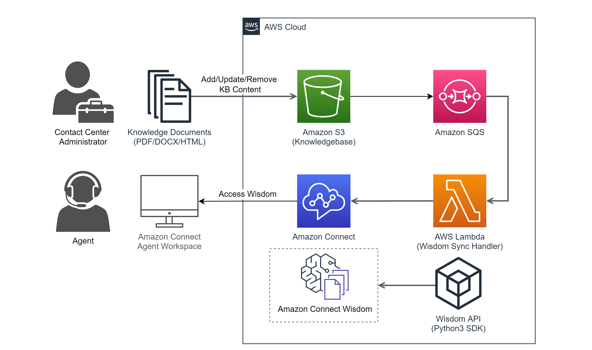

# AWS CDK Wisdom S3 Integration Infra.

## Useful commands

- `npm run build` compile typescript to js
- `npm run watch` watch for changes and compile
- `npm run test` perform the jest unit tests
- `cdk deploy` deploy this stack to your default AWS account/region
- `cdk diff` compare deployed stack with current state
- `cdk synth` emits the synthesized CloudFormation template

## Architecture being created.

## Reference documents.

- https://docs.aws.amazon.com/wisdom/latest/APIReference/API_Operations.html

- https://github.com/aws/amazon-connect-wisdomjs#QueryAssistant

- https://aws.amazon.com/blogs/contact-center/ingesting-content-to-power-real-time-recommendations-and-search-with-amazon-connect-wisdom/

- https://docs.aws.amazon.com/connect/latest/adminguide/enable-wisdom.html

- https://www.youtube.com/watch?v=e8o559FcL6c&t=673s&ab_channel=AWSEvents
